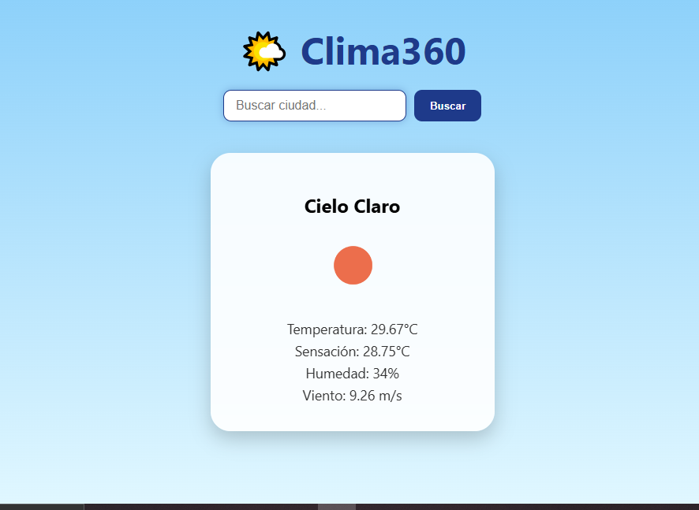

## 🔹 Sobre este proyecto

Este proyecto es una **Weather App fullstack** que permite consultar el clima de cualquier ciudad utilizando la API de OpenWeatherMap. 

**Mi rol en el proyecto:**
- Desarrollador fullstack: construí tanto el backend con Spring Boot como el frontend con React.
- Integré la API externa para obtener datos del clima en tiempo real.
- Diseñé y desarrollé la interfaz de usuario con CSS moderno, asegurando que sea **responsive** para móviles y desktop.
- Configuré Git y GitHub para control de versiones y despliegue del proyecto.

**Aprendizajes clave:**
- Manejo de **peticiones HTTP** desde el frontend y el backend, incluyendo la gestión de CORS.
- Uso de **programación reactiva** con Spring WebFlux y Mono.
- Organización de proyectos fullstack, separando frontend y backend de forma profesional.
- Buenas prácticas de desarrollo: código limpio, modular y documentado.
- Cómo crear un README claro y atractivo, incluyendo capturas de pantalla y documentación del proyecto.

- ## 🔹 Capturas de pantalla

